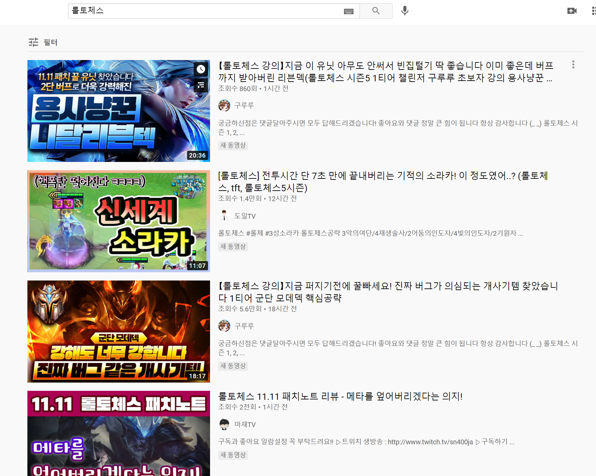

# TFT DECK CARD MAKER

추후에 보완되어 다시 배포될 수도 있음

**tft deck card maker 링크 ⇒** <https://60ae0a6fe8f9b7b5c17b7631--tft-deck-maker.netlify.app>

🆕 **css 수정 중이라 배포 사이트에 에러가 있을 수 있습니다. 수정 후 최종 사이트 주소 다시 올리겠습니다 😉**

---

여러 사람들이 즐겨하는 **TFT 전략적 팀 전투** 이름하여 **롤토체스**라는 게임과 관련하여 만든 사이트입니다.

## TFT(전략적 팀 전투 = 롤토체스)는 어떤 게임인가?

전략적 팀 전투는 라이엇 게임즈에서 기존에 있던 리그오브레전드라는 게임의 챔피언, 아이템, 스킬 등을 기반으로 만들어낸 체스 형식의 게임입니다. 각자 두개이상의 시너지를 가진 챔피언들과 특별한 능력을 지닌 아이템들을 조합하여 8명 가운데 1등을 가리는 방식으로 진행됩니다.

**덱**이란 게임 진행시 내가 만들게 되는 챔피언, 시너지, 아이템의 조합을 뜻합니다. 그리하여 요즘에는 자신이 게임에서 1등을 한 덱(조합)을 추천하고 보여주는 영상이나 글들이 인기를 끌기도 합니다.



---

## 기술 스택

       

## 디렉토리

```
    ─src
    ├─components
    │  ├─addform
    │  ├─card
    │  ├─cardName
    │  ├─cards
    │  ├─card_container
    │  ├─card_editor
    │  ├─card_maker
    │  ├─deck
    │  ├─footer
    │  ├─header
    │  ├─home
    │  ├─item
    │  ├─login
    │  └─select_champion
    ├─font
    ├─image
    │  ├─chamImage
    │  └─ItemImage
    └─service
```

---

## 사이트 소개

### Home page ( About page )

처음 접속하면 나오는 홈 페이지입니다. 3개의 슬라이드에 사이트에 대한 간단한 소개가 되어있고 ' 지금 바로 덱 카드 만들기! ' 버튼을 누르면 로그인 페이지로 이동합니다.

이전에 로그인을 하고 로그아웃을 하지 않은 회원일 경우 자동 로그인 되어 카드 메이커 페이지로 이동합니다.


### Signup and Login page

회원가입 페이지는 이메일과 비밀번호로만 회원가입을 할 수 있도록 만들었습니다. 추가적인 정보를 적는 란들을 넣을까 하다가 게임은 스피드가 생명이므로 빠르게 회원가입을 할 수 있도록 정말 간단하게 구현해 보았습니다. 🤗


### Card maker page (Main page)

덱 카드 생성 페이지에서는 카드 이름, 테마, 주요 덱, 챔피언, 아이템을 선택하고 카드를 추가할 수 있습니다. 로그인한 회원의 카드 정보는 로그아웃 후, 페이지를 나간 후에도 유지됩니다.


---

## 만들게 된 계기

React에 대해 공부하게 되면서 이제는 내가 만들고 싶은 주제로 사이트를 구현해 낼 수 있지 않을까 하는 자신감이 생기게 되었습니다. 그리하여 제가 요즘 제일 빠져있는 게임인 롤토체스를 바탕으로 사이트를 구현하게 되었습니다.

이미 롤토체스를 기반으로 한 정보사이트인 '롤체지지' 라는 사이트가 존재하고 있습니다. 하지만 이 사이트를 이용할때마다 요즘 인기있는 덱, 추천하는 덱을 보는 것에 그치지 않고 내가 해보니 좋았던 덱을 저장할 수 있는 기능이 있다면 더 재밌게 게임을 즐길 수 있지 않을까 아쉬움이 들었습니다. 그리하여 이참에 내가 만들어보자! 결심하고 만들게 되었습니다.

---
